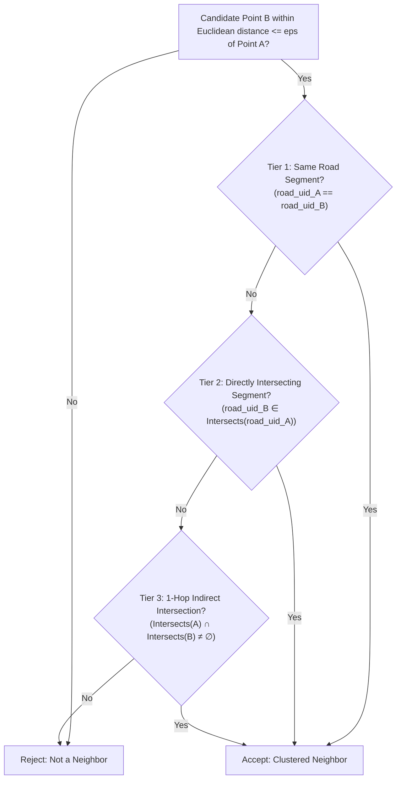

# 🚦 High-Accident Risk Zone Identification via Network-Constrained DBSCAN

<p align="center">
  
</p>

<p align="center">
  <b>Production-Grade Geospatial Clustering Engine: Identifying 130+ Traffic Accident Blackspots across Road Network Corridors</b>
</p>

<p align="center">
  <a href="https://www.python.org/"></a>
  <a href="https://geopandas.org/"></a>
  <a href="https://shapely.readthedocs.io/"></a>
  <a href="https://python-visualization.github.io/folium/"></a>
  <a href="https://epsg.io/32645"></a>
  <a href="LICENSE"></a>
</p>

---

## 📌 1. The Core Problem: Why Standard Euclidean DBSCAN Fails

In transportation safety and urban planning, standard spatial clustering algorithms (such as naive Euclidean DBSCAN) compute neighbor proximity straight "as the crow flies":

$$\text{dist}(p_1, p_2) = \sqrt{(x_1 - x_2)^2 + (y_1 - y_2)^2} \le \epsilon$$

```
             Overpass / Flyover (Road A)
Road A: ═════ ● (Accident 1) ═══════════════ ● (Accident 2) ═════
                  │
                  │  ~30m Euclidean Distance (Close in 2D space)
                  │  ❌ NO PHYSICAL ROAD CONNECTION / BARRIER
                  │
Road B: ───── ● (Accident 3) ─────────────── ● (Accident 4) ─────
             Underpass / Divided Highway (Road B)
```

### The Spatial Leakage Flaw
* When two accidents occur on parallel lanes of a divided highway separated by a concrete median barrier, or on a grade-separated overpass crossing above an underpass, their 2D Euclidean distance is often small ($20\text{m} - 50\text{m}$).
* Standard Euclidean DBSCAN clusters them into a single misleading "super hotspot", even though a vehicle cannot physically traverse between the two roads without driving miles to a distant interchange.

---

## 🔗 2. The Solution: 3-Tier Topological Connectivity Cascade

This engine enforces that two incident points $P_A$ (on road segment $S_A$) and $P_B$ (on road segment $S_B$) are considered cluster neighbors **if and only if**:
1. **Metric Distance Constraint:** $\text{dist}(P_A, P_B) \le \epsilon$ in metric space (UTM Zone 45N meters).
2. **Topological Network Constraint:** $S_A$ and $S_B$ satisfy the 3-Tier Connectivity Cascade:



### 3-Tier Adjacency Logic
* **Tier 1 (Same Segment):** `road_uid_A == road_uid_B` $\rightarrow$ Both crashes occurred along the exact same physical road stretch.
* **Tier 2 (Direct Geometric Intersection):** `road_uid_B ∈ segment_intersections[road_uid_A]` $\rightarrow$ The two segments intersect or meet at a junction.
* **Tier 3 (1-Hop Indirect Intersection):** `not Intersects(A).isdisjoint(Intersects(B))` $\rightarrow$ Segments $A$ and $B$ both connect directly to a common intermediate road segment $C$ ($A \leftrightarrow C \leftrightarrow B$).
* **Off-Road Incident Isolation:** If an incident has missing road association (`road_uid == -999` or `NaN`), it is prevented from connecting to network points, eliminating artificial "bridges" across separate corridors.

---

## 🏎️ 3. DSU Road Grouping & R-Tree Spatial Acceleration

### Disjoint Set Union (DSU) Road Grouping
To handle dual-carriageway divided highways or parallel frontage roads, road segments within a buffer threshold are merged into unified corridor groups using Union-Find with **Path Compression** and **Union by Rank** ($\mathcal{O}(\alpha(N))$ time):

```python
parent = {uid: uid for uid in road_gdf['road_uid']}
rank = {uid: 0 for uid in road_gdf['road_uid']}

def find_set(item):
    if parent[item] == item:
        return item
    parent[item] = find_set(parent[item])  # Path compression
    return parent[item]
```

### R-Tree Spatial Indexing (`sindex`)
* Pairwise road collision checks are pre-computed using GEOS R-Tree spatial indexing (`road_gdf.sindex.query(predicate='intersects')`).
* Reduces topological intersection checks from $\mathcal{O}(M^2)$ to $\mathcal{O}(M \log M)$, where $M$ is the number of road segments.

### Metric Reprojection (`CRSchnager.py`)
* Transforms raw coordinates from angular WGS84 degrees (`EPSG:4326`) to Universal Transverse Mercator Zone 45N (`EPSG:32645`), ensuring all $\epsilon$ distance buffers and convex hull areas are true-to-scale in meters.

---

## 📊 4. Quantitative Results & Top Risk Zones

Evaluated on the regional road network ($\epsilon = 150.0\text{ m}, \text{MinPts} = 5, \text{Intersection Tolerance} = 0\text{ m}$):

* **Total Extracted Hotspots:** **130+ distinct network-constrained accident blackspots**.
* **Top Risk Clusters:**

| Cluster ID | Total Accidents | Centroid X (UTM m) | Centroid Y (UTM m) | Convex Hull Area ($m^2$) | Primary Location Type |
| :--- | :--- | :--- | :--- | :--- | :--- |
| **Cluster 65** | **47** | `640618.03` | `2493479.98` | $\approx 196,138 \text{ m}^2$ | Major Arterial Interchange |
| **Cluster 105** | **38** | `639660.36` | `2496581.69` | $\approx 194,847 \text{ m}^2$ | Commercial High-Density Junction |
| **Cluster 44** | **38** | `638471.18` | `2491178.75` | $\approx 221,805 \text{ m}^2$ | Multi-Leg Highway Connector |
| **Cluster 118** | **33** | `639104.71` | `2497777.88` | $\approx 140,974 \text{ m}^2$ | Urban Transit Corridor |
| **Cluster 109** | **31** | `640968.07` | `2496642.59` | Linear Corridor | Divided Arterial Road |
| **Cluster 19** | **28** | `638458.10` | `2488836.79` | $\approx 79,130 \text{ m}^2$ | Industrial Bypass Link |

---

## 🗺️ 5. Interactive Cartographic Visual Deliverables

The engine exports an interactive **Folium / Leaflet GIS Web Application** (`cluster_map_eps150.0_mp5.html`):

| Map Layer | Description | Visual Element |
| :--- | :--- | :--- |
| **Road Network** | Topological road centerline linestrings | Gray vector overlay with dynamic tooltips |
| **Cluster Points** | Grouped accident locations | Categorically colored circle markers by cluster ID |
| **Centroids** | Weighted geometric center of each danger zone | Blue interactive marker icons with size info |
| **Convex Hulls** | Spatial polygons bounding each danger zone | Semi-transparent polygons with calculated area ($m^2$) |
| **Accident Heatmap** | Continuous kernel density estimation (KDE) | Multi-gradient density heat surface |

---

## 📁 6. Modular Package Architecture

The codebase is organized into decoupled domain modules following SOLID and Clean Architecture principles:

```
high-accident-risk-zones/
│
├── data/                                    # 📊 Spatial GIS Datasets
│   ├── raw_csv/                             # Tabular accident & transit records
│   ├── shapefiles_wgs84/                    # Raw WGS84 Geographic Shapefiles (EPSG:4326)
│   └── shapefiles_projected_utm/            # UTM Zone 45N Metric Shapefiles (EPSG:32645)
│
├── results/                                 # 🗺️ Analysis Outputs & Deliverables
│   ├── interactive_maps/                    # Leaflet / Folium HTML web maps
│   ├── static_plots/                        # High-resolution PNG figures
│   ├── spatial_layers/                      # Output GeoPackages (.gpkg)
│   └── reports/                             # CSV summary metrics & hotspot stats
│
├── src/                                     # 🐍 Core Python Source Package
│   └── risk_zones/                          # Modular 'risk_zones' Package
│       ├── __init__.py                      # Package exports & public API
│       ├── config.py                        # Pipeline configuration dataclass
│       ├── io/                              # Data loading, validation & CRS transformation
│       │   ├── loader.py                    # Vector loading & geometry repair
│       │   └── reprojector.py               # Coordinate reprojection (WGS84 -> UTM 45N)
│       ├── topology/                        # Road Graph & Spatial Indexing
│       │   ├── dsu.py                       # Disjoint Set Union road grouping
│       │   ├── spatial_index.py             # GEOS R-Tree spatial indexing wrapper
│       │   └── graph.py                     # 3-Tier Topological Connectivity Cascade
│       ├── clustering/                      # Clustering Algorithms
│       │   ├── dbscan.py                    # Network-Constrained DBSCAN engine
│       │   └── metrics.py                   # Centroids, convex hulls, cluster areas
│       └── visualization/                   # Cartographic & Visualization Engines
│           ├── scale_control.py             # Leaflet custom MacroElement scale bar
│           ├── web_map.py                   # Folium interactive map builder
│           └── static_plot.py               # Matplotlib publication figures
│
├── tests/                                   # 🧪 Automated Test Suite (12+ Unit Tests)
│   ├── test_dsu.py                          # Tests for Union-Find path compression & rank
│   ├── test_topology.py                     # Tests for 3-tier connectivity logic
│   ├── test_dbscan.py                       # Tests for metric DBSCAN clustering
│   └── test_metrics.py                      # Tests for centroids & convex hull calculations
│
├── run_pipeline.py                          # 🚀 Unified CLI Runner & Entrypoint
├── pyproject.toml                           # 📦 Python packaging definition
├── requirements.txt                         # ⚙️ Pinned environment dependencies
└── README.md                                # 📖 Documentation
```

---

## 🚀 7. Installation & Quick Start

### 1. Install Dependencies
```bash
pip install -r requirements.txt

# Or install package in editable mode:
pip install -e .
```

### 2. Run the Automated Test Suite
```bash
python -m unittest discover tests
```

### 3. Execute the Hotspot Analysis Pipeline
```bash
# Run with default optimal parameters (eps=150m, MinPts=5)
python run_pipeline.py

# Or customize clustering parameters via CLI flags:
python run_pipeline.py --eps 120 --min-pts 4 --tolerance 5.0
```

### 4. View Results & Interactive Map
Open the interactive Leaflet map in your browser:
```bash
# Linux
google-chrome results/interactive_maps/cluster_map_eps150.0_mp5.html

# macOS
open results/interactive_maps/cluster_map_eps150.0_mp5.html
```

---

## ⚙️ 8. CLI Configuration Parameters

| Argument | Type | Default | Description |
| :--- | :--- | :--- | :--- |
| `--eps` | `float` | `150.0` | Spatial distance search radius in meters (UTM Zone 45N). |
| `--min-pts` | `int` | `5` | Minimum incident points required to form a dense core cluster. |
| `--tolerance` | `float` | `0.0` | Geometric buffer tolerance to bridge GIS digitization micro-gaps (meters). |
| `--road-shp` | `str` | `None` | Custom path to road network shapefile. |
| `--accident-shp` | `str` | `None` | Custom path to accident incident shapefile. |
| `--output-dir` | `str` | `results/` | Destination folder for reports, GIS layers, and maps. |
| `--no-interactive-map`| `flag` | `False` | Disables Folium HTML generation. |
| `--no-static-map` | `flag` | `False` | Disables Matplotlib PNG generation. |

---

## 📜 9. License & Author

* **Author:** [Abhishek Gupta](https://github.com/abhishekgupta1025)
* **License:** MIT License
